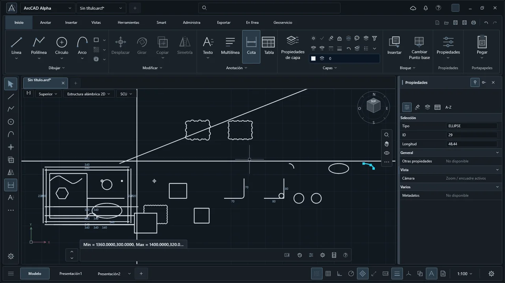
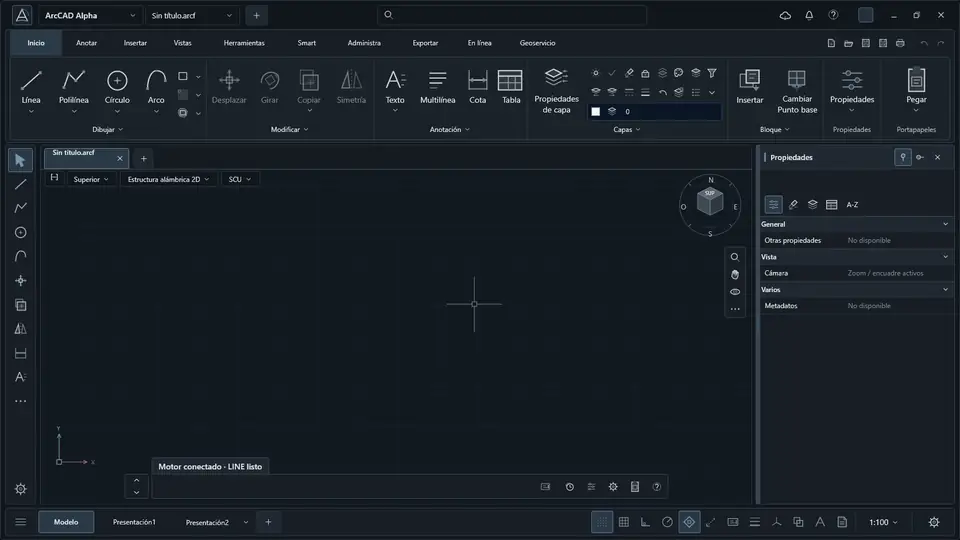
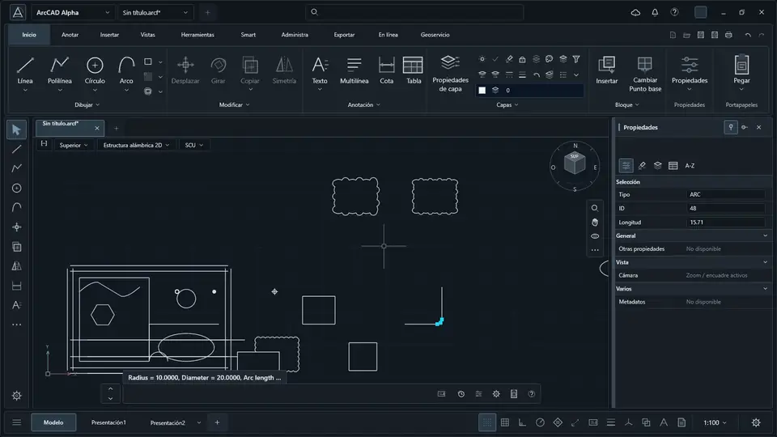

<p align="center">
  
</p>

# ArcCAD

### A native desktop CAD alpha with a Rust geometry engine, an Avalonia interface, transactional editing, and its own open drawing format.

[](https://github.com/FaridDevU/ArqCAD/actions/workflows/ci.yml)


[](LICENSE)

---

## What is it?

ArcCAD is a clean-room 2D CAD project built around a Rust core. The engine owns
geometry, commands, transactions, selection, rendering data, and persistence.
The Windows desktop app uses Avalonia and talks to the engine through a small C
ABI.

This repository is an early public alpha. It is useful for development and
experimentation, but it is not yet a complete replacement for a production CAD
suite.

---

## Real app demos

Everything below is rendered by the compiled application and exercised through
the real native engine. No mockups or pre-rendered UI concepts.

### Drawing, snapping, and selection

Create native geometry, preview a command, snap to an endpoint, inspect the
selection, and move through undo and redo.

[](media/drawing-selection.mp4)

### Native shapes and measurements

FILLET, tangent circles, circle and arc modes, dimensions, lineweight, and
analytic measurements run through the same transactional core.

[](media/native-shapes.mp4)

### History and persistence

Save an `.arcf` drawing, protect unsaved work, reopen the document with stable
entity IDs, and start a clean drawing.

[](media/history-persistence.mp4)

---

## Working today

- Native 2D entities including lines, polylines with bulges, circles, arcs,
  ellipses, splines, points, rays, construction lines, and wipeouts.
- Drawing and editing commands such as LINE, PLINE, CIRCLE, ARC, MOVE, COPY,
  ROTATE, SCALE, MIRROR, TRIM, EXTEND, FILLET, CHAMFER, BREAK, JOIN, STRETCH,
  ARRAY, EXPLODE, and REVERSE.
- Transactional undo and redo with stable entity IDs.
- Layers, colors, linetypes, lineweights, selection, object snaps, properties,
  and geometry queries.
- Atomic `.arcf` save/open plus DXF import and export for the supported entity
  subset.
- A real Avalonia desktop shell with ribbon tools, command input, viewport,
  grid/UCS controls, layer controls, and property inspection.
- A versioned C ABI and typed C# gateway with app-local native loading.
- Headless desktop regression coverage and cross-platform Rust CI.

---

## Architecture

```text
Avalonia desktop (C# / XAML)
              |
              | typed P/Invoke
              v
        af-ffi (C ABI)
              |
              v
      af-api + af-cmd (Rust)
              |
       +------+------+
       |             |
  geometry/model   I/O/render/select
```

The Rust session is the source of truth. Desktop actions cross the same command
gateway used by tests and scripting, so UI behavior and headless behavior share
one implementation.

---

## Build from source

### Requirements

- Windows 11 x64
- Rust `1.95.0` with the `x86_64-pc-windows-gnullvm` toolchain
- .NET SDK `10.0.302`
- Git

### Native engine and desktop

```powershell
git clone https://github.com/FaridDevU/ArqCAD.git
cd ArqCAD

$toolchain = '1.95.0-x86_64-pc-windows-gnullvm'
rustup toolchain install $toolchain --profile minimal --component rustfmt --component clippy

$sysroot = (rustup run $toolchain rustc --print sysroot).Trim()
$toolchainBin = Join-Path $sysroot 'lib\rustlib\x86_64-pc-windows-gnullvm\bin'
$env:CARGO_TARGET_X86_64_PC_WINDOWS_GNULLVM_LINKER = `
  (Join-Path $toolchainBin 'rust-lld.exe')
$env:PATH = "$toolchainBin;$env:PATH"

rustup run $toolchain cargo build --locked -p af-ffi --release

$runtime = Join-Path $toolchainBin 'libunwind.dll'
$native = (Resolve-Path 'target\release').Path
Copy-Item -LiteralPath $runtime -Destination $native -Force

dotnet run --project apps\desktop\ArcForge.Desktop\ArcForge.Desktop.csproj `
  -c Release -r win-x64 `
  -p:ArcCadNativeDirectory=$native
```

### Tests

```powershell
rustup run 1.95.0-x86_64-pc-windows-gnullvm cargo test --locked --workspace
rustup run 1.95.0-x86_64-pc-windows-gnullvm cargo fmt --all -- --check
rustup run 1.95.0-x86_64-pc-windows-gnullvm cargo clippy --locked --workspace --all-targets -- -D warnings
```

The Windows CI job also builds the native DLL, verifies app-local loading, and
runs the compiled desktop harness.

---

## Repository layout

```text
apps/desktop/               Avalonia application and C# native gateway
crates/af-api/              Session API used by desktop and scripting
crates/af-cmd/              Command registry and command implementations
crates/af-geom/             Geometry algorithms and intersections
crates/af-model/            Document, entities, transactions, and layers
crates/af-ffi/              Versioned C ABI
crates/af-io-*/             Native format and DXF I/O
crates/af-render/            Renderer-facing geometry data
crates/af-select/            Selection, snapping, and spatial index
tools/desktop-screenshot/   Headless desktop regression harness
```

---

## Alpha status

The current target is Windows x64. The UI is Spanish-first, while public
documentation and code comments are maintained in English.

Not ready yet:

- signed installer and packaged releases;
- full DWG read/write support;
- complete 3D modeling and specialized CAD toolsets;
- full parity across every command, file edge case, and interactive workflow;
- production guarantees for untrusted drawings.

Expect breaking changes in the ABI, native file format, UI, and command
contracts while the alpha evolves.

---

## Clean-room boundary

ArcCAD is an independent implementation. Third-party CAD products are used only
as behavioral references where legally permitted. Their code, assets, icons,
branding, and proprietary file internals are not part of this repository.

---

## License

Licensed under the [Apache License 2.0](LICENSE).

Built in the open by [FaridDevU](https://github.com/FaridDevU).
